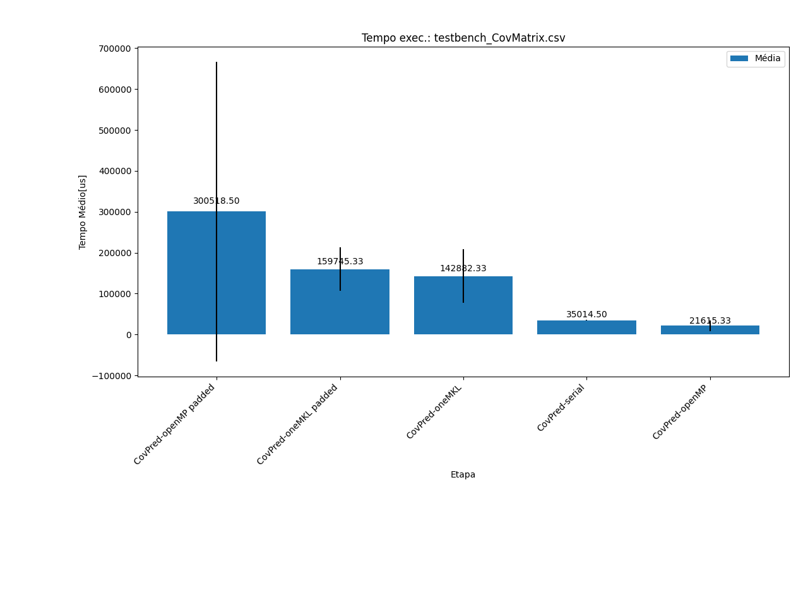

# Melhorias de implementação de código

## Uso de `#pragmas` para paralelismo em CPU

Para facilitar o desenvolvimento de códigos com uso de instruções AVX, recorre-se a diretivas de compilação que permitem o compilador construir o código com instruções AVX denotando independencia entre os dados utlizados. 
Dentre os mais conhecidos (levando em conta a utilização do compilador icpx - INTEL):

- `pragma ivdep `: Loop independente, mas que realiza uma vetorização segura por meio de heuristicas, mas não é uma ação imperativa utilizada durante a vetorização. 

- `pragma simd vectorlenght(AVX_LEN) aligned ? `:  Declaração para o compilador que o trecho de código possui, alem da independencia de dados, a possibilidade de fazer uso das ferramentas SIMD AVX/SSE. Isso permite uma granularidade fina de instruções (se os dados estiverem alinhado, o desempenho é melhor). Esse tipo de compilação é mais imperativa, ficando a cargo do programador verificar dependencias quebradas, caso haja.

## Uso de bibliotecas/frameworks voltadas para matrizes
oneAPI: Framework desenvolvida pela INTEL com base na bibl. BLAS/LAPACK para calculo matemático. Suas instruções são voltadas para o desenvolvimento de operações matricias/vetoriais adequando-se aos moldes da arquitetura disponivel. Nesse escopo, utilizamos além da framework oneAPI, a própria BLAS/LAPACK com o intuito de comparar o desempenho de cada uma delas. Abaixo, as instruções utilizadas: 

### Utilizada da oneAPI:
- `oneapi::mkl::blas::row_major::gemm`: 
<!-- - `oneapi::mkl::lapack::row_major::potri` -->
<!-- - `oneapi::mkl::lapack::row_major::potrf` -->

### Utilizado da BLAS/LAPACK Nativa:
- `cblas_?gemm`: multiplicação matricial, sob os mesmos moldes da operação __gemm__ desenvolvida na oneAPI. É possivel fazer o uso dos formatos : double (?=d), float (?=s).

#### Porque usar intel MKL/Referencias Interessantes
- [Application in Teaching](https://www.mathematik.uni-ulm.de/%7Elehn/apfel/ulmBLAS/#toc3)
- [The Science of Programming Matrix Computations](https://www.cs.utexas.edu/users/rvdg/tmp/TSoPMC.pdf)

## Resultado obtido
O comparativo de execução abaixo leva em conta as matrizes de entrada com valor de Nx=15, sendo todas matrizes quadradas com valores inicialmente aleatórios.

Temos que a biblioteca oneMKL e suas implementações utilizadas no escopo de CPU apresentam uma grande eficiencia para o calculo de matrizes com tamanhos consideraveis. No grafico anterior, temos o comparativo do tempo de execução para uma matriz relativamente pequena. 

<!-- No grafico a seguir (generalizando a função de Predição da Matriz de Covariancia), temos um resultado eficaz para quando temos matrizes maiores.  -->

